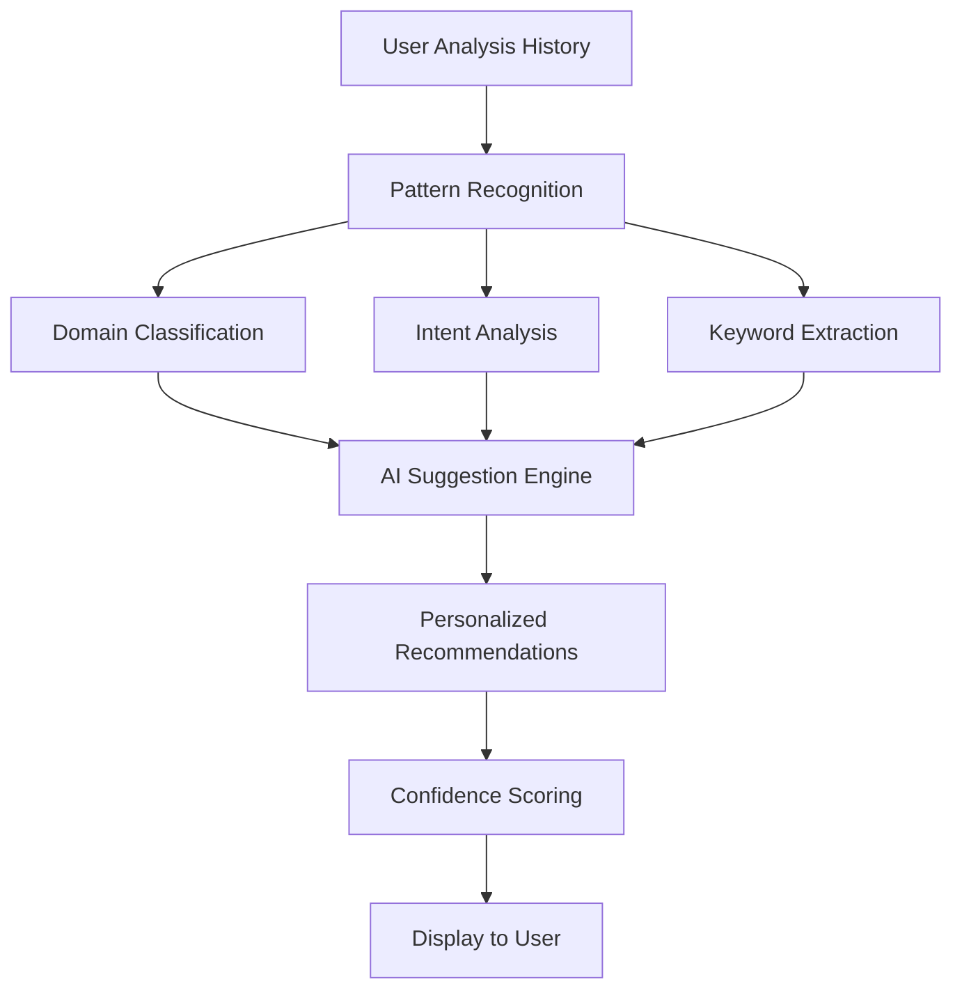

# 🚀 Smart Template Generation System

## Overview

The Strategic Intelligence App now features a comprehensive **AI-Powered Smart Template Generation System** that learns from user behavior and automatically generates intelligent template suggestions. This system includes:

- **🤖 AI-Powered Template Suggestions** based on user history
- **📋 Real-time Template Recommendations** as you type
- **💾 Save Analysis as Template** functionality
- **📊 Usage-Based Learning** and analytics
- **🔍 User History Tracking** for personalized experiences

---

## 🌟 Key Features

### 1. **AI-Powered Template Suggestions**
- **Personalized recommendations** based on your analysis history
- **Confidence scores** for each suggestion (shown as percentages)
- **Dynamic refresh** to get updated suggestions
- **Usage analytics** showing your patterns and preferences

### 2. **Real-Time Template Recommendations**
- **Automatic detection** when you start typing a strategic question
- **Intelligent matching** based on keywords, domain, and intent
- **One-click application** to auto-populate form fields
- **Relevance scoring** based on similarity and usage

### 3. **Save Analysis as Template**
- **Convert completed analyses** into reusable templates
- **Custom categorization** and descriptions
- **Template sharing** within the organization
- **Version tracking** and usage statistics

### 4. **Smart Pattern Recognition**
- **Automatic domain extraction** (Market, Technology, Risk, etc.)
- **Intent classification** (Market Entry, Competitive Analysis, etc.)
- **Keyword analysis** for better matching
- **Learning algorithms** that improve over time

### 5. **User Analytics Dashboard**
- **Usage patterns** and frequency analysis
- **Domain distribution** of your analyses
- **Intent tracking** for behavioral insights
- **Trend analysis** and recommendations

---

## 🎯 How It Works

### **AI Template Suggestions Engine**



### **Learning Process**

1. **Query Tracking**: Every analysis is automatically tracked and analyzed
2. **Pattern Extraction**: AI extracts domains, intents, and keywords
3. **Frequency Analysis**: System learns your most common patterns
4. **Suggestion Generation**: Creates personalized template suggestions
5. **Continuous Learning**: Improves recommendations over time

---

## 📊 Database Schema

### **User Query Patterns Table**
```sql
CREATE TABLE user_query_patterns (
    id SERIAL PRIMARY KEY,
    user_id VARCHAR(100) DEFAULT 'anonymous',
    strategic_question TEXT NOT NULL,
    time_frame VARCHAR(100),
    region VARCHAR(100),
    additional_instructions TEXT,
    question_keywords TEXT,
    extracted_domain VARCHAR(200),
    extracted_intent VARCHAR(200),
    created_at TIMESTAMP DEFAULT CURRENT_TIMESTAMP
);
```

### **User Generated Templates Table**
```sql
CREATE TABLE user_generated_templates (
    id SERIAL PRIMARY KEY,
    template_id INTEGER REFERENCES analysis_templates(id),
    source_session_id INTEGER REFERENCES analysis_sessions(id),
    user_id VARCHAR(100),
    created_at TIMESTAMP DEFAULT CURRENT_TIMESTAMP
);
```

---

## 🔧 API Endpoints

### **Smart Template Generation**

| Endpoint | Method | Description |
|----------|--------|-------------|
| `/api/track-query-pattern` | POST | Track user query patterns |
| `/api/ai-template-suggestions/{user_id}` | GET | Get AI-powered suggestions |
| `/api/get-template-recommendations` | POST | Get real-time recommendations |
| `/api/save-analysis-as-template` | POST | Save analysis as template |
| `/api/popular-query-patterns` | GET | Get trending patterns |
| `/api/generate-smart-template` | POST | Auto-generate smart templates |
| `/api/user-analytics/{user_id}` | GET | Get user analytics |

### **Example Usage**

```javascript
// Get AI suggestions
const response = await fetch('/api/ai-template-suggestions/user123?limit=3');
const suggestions = await response.json();

// Save analysis as template
const templateData = {
    session_id: 12345,
    template_name: "Market Expansion Analysis",
    template_description: "Template for analyzing market expansion opportunities",
    category: "Market Analysis",
    user_id: "user123"
};

await fetch('/api/save-analysis-as-template', {
    method: 'POST',
    headers: { 'Content-Type': 'application/json' },
    body: JSON.stringify(templateData)
});
```

---

## 🎨 User Interface Features

### **AI Suggestions Section**
- **Purple gradient design** with confidence indicators
- **Interactive cards** with hover effects
- **Refresh button** for updated suggestions
- **Usage analytics** summary display

### **Template Recommendations**
- **Real-time appearance** as you type
- **Blue gradient design** for easy identification
- **Usage count** and relevance indicators
- **One-click application** functionality

### **Save as Template Modal**
- **Modern modal design** with smooth animations
- **Form validation** and error handling
- **Category selection** dropdown
- **Success notifications** with toast messages

### **Button States**
- **Start Analysis**: Primary action button
- **Download PDF**: Appears after completion
- **Save as Template**: Appears after completion
- **Loading states** with spinners and transitions

---

## 🧠 AI Intelligence Features

### **Domain Classification**
The system automatically detects these domains:
- **Market**: Customer, competitor, market analysis
- **Technology**: Digital transformation, AI, innovation
- **Finance**: Investment, budget, ROI analysis
- **Risk**: Security, compliance, threat assessment
- **Strategy**: Planning, vision, direction
- **Operations**: Process, efficiency, supply chain
- **Geopolitical**: Regulatory, policy, regional analysis

### **Intent Recognition**
Automatically identifies analysis intent:
- **Market Entry**: Expansion and entry strategies
- **Competitive Analysis**: Competitor assessment
- **Risk Assessment**: Risk identification and mitigation
- **Opportunity Analysis**: Growth opportunities
- **SWOT Analysis**: Organizational assessment
- **Scenario Planning**: Future planning
- **General Analysis**: Comprehensive strategic analysis

### **Smart Question Generation**
AI generates contextual strategic questions based on:
- **User patterns** and preferences
- **Domain expertise** and best practices
- **Industry standards** and frameworks
- **Previous successful** analyses

---

## 📈 Analytics & Learning

### **User Behavior Tracking**
- **Query frequency** and patterns
- **Domain preferences** and trends
- **Time frame** selections
- **Regional focus** areas
- **Success patterns** and outcomes

### **Template Performance**
- **Usage statistics** and popularity
- **Success rates** and effectiveness
- **User feedback** and ratings
- **Continuous improvement** metrics

### **Learning Algorithms**
- **Collaborative filtering** for recommendations
- **Content-based filtering** for similarity
- **Frequency analysis** for popular patterns
- **Trend detection** for emerging patterns

---

## 🚀 Getting Started

### **For Users**

1. **Start using** the application normally
2. **Complete analyses** to build your pattern history
3. **Check AI suggestions** on the home page
4. **Use template recommendations** as you type
5. **Save successful analyses** as templates

### **For Developers**

1. **Database setup** is automatic on first run
2. **API endpoints** are ready to use
3. **Frontend integration** is complete
4. **Customization** is available in `database_service.py`

### **Configuration**

```python
# Adjust AI suggestion parameters
SUGGESTION_LIMIT = 3
PATTERN_THRESHOLD = 2  # Minimum frequency for patterns
ANALYTICS_WINDOW = 30  # Days for analytics

# Customize domain keywords
DOMAIN_KEYWORDS = {
    'market': ['market', 'customer', 'competitor'],
    'technology': ['technology', 'digital', 'ai'],
    # ... add more domains
}
```

---

## 🔮 Future Enhancements

### **Planned Features**
- **🌐 Cross-user learning** (with privacy protection)
- **📚 Template library sharing** and marketplace
- **🎯 Advanced ML models** for better predictions
- **📱 Mobile optimization** for suggestions
- **🔗 Integration** with external data sources
- **📊 Advanced analytics** dashboard
- **🤝 Team collaboration** features

### **AI Improvements**
- **Natural Language Processing** for better understanding
- **Sentiment analysis** for template optimization
- **Predictive analytics** for proactive suggestions
- **Multi-language support** for global users

---

## 🛡️ Privacy & Security

- **Anonymous tracking** by default
- **User consent** for data collection
- **Data encryption** for sensitive information
- **Retention policies** for user data
- **Opt-out options** for tracking

---

## 🤝 Contributing

### **How to Contribute**
1. **Test the features** and provide feedback
2. **Report bugs** or suggest improvements
3. **Contribute patterns** and templates
4. **Share usage insights** and analytics

### **Development Areas**
- **AI/ML algorithms** improvement
- **UI/UX enhancements**
- **Performance optimization**
- **Testing and validation**

---

## 📞 Support

For questions or issues with the smart template system:
- **Technical issues**: Check the console logs
- **Feature requests**: Submit through the feedback system
- **Documentation**: Refer to this guide
- **Community**: Join our developer discussions

---

*The Smart Template Generation System is designed to continuously learn and improve. The more you use it, the better it gets at predicting your needs and providing relevant suggestions!* 🚀 